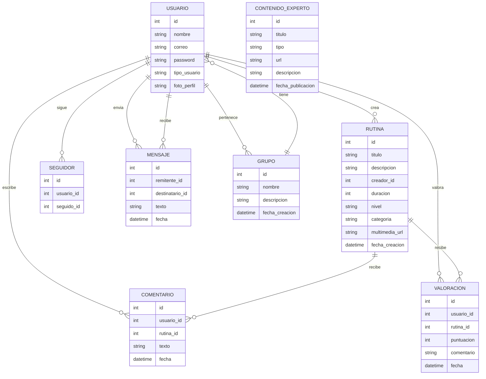

# Esquema de Base de Datos - A MI RITMO

---

## Diagrama ER

<small>Diagrama generado según las historias de usuario y requisitos del proyecto.</small>

---

## Descripción

El sistema "A MI RITMO" se basa en usuarios que pueden crear, buscar y compartir rutinas de ejercicio. Cada rutina puede recibir comentarios y valoraciones de otros usuarios. Los usuarios pueden seguirse entre sí, enviar mensajes privados y formar grupos temáticos. Además, existe una sección de contenido de expertos en fitness. Las entidades principales son USUARIO, RUTINA, COMENTARIO, VALORACION, SEGUIDOR, MENSAJE, CONTENIDO_EXPERTO y GRUPO. Las relaciones permiten la interacción social, la personalización y el acceso a contenido relevante, alineándose con los objetivos del proyecto y las historias de usuario.

<small>Descripción generada según las historias de usuario y requisitos del proyecto.</small>

---

<small>Agrega más entidades y relaciones a medida que tu proyecto crezca.</small>
