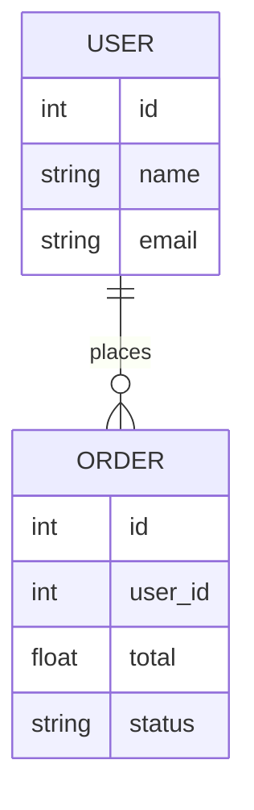

# Database Schema Template

_What are the main entities and relationships in your data model?_

---

## ER Diagram

<small>(Example diagram. Replace or expand as needed for your project.)</small>

---

## Description

_Describe the main entities, their relationships, how they interact, and why they fit into the big picture. describe in natural language_

Imagine a scenario where a user, Jane, places multiple orders over several months. Each order is linked to her user profile, allowing the system to show her a personalized order history. This enables features like "Reorder" and targeted promotions. The relationship between USER and ORDER is essential for these user-centric experiences.

<small>(Example description. Replace or expand as needed for your project.)</small>

---

<small>Add more entities and relationships as your project grows.</small>
