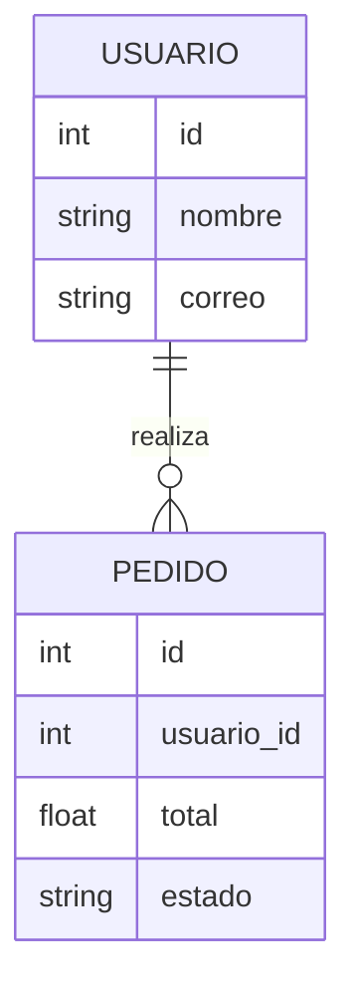

# Plantilla de Esquema de Base de Datos

_¿Cuáles son las entidades principales y relaciones en tu modelo de datos?_

---

## Diagrama ER

<small>(Diagrama de ejemplo. Reemplaza o amplía según sea necesario para tu proyecto.)</small>

---

## Descripción

_Describe las entidades principales, sus relaciones, cómo interactúan y por qué encajan en el panorama general. Describe en lenguaje natural._

Imagina un escenario donde una usuaria, Jane, realiza múltiples pedidos durante varios meses. Cada pedido está vinculado a su perfil de usuario, lo que permite al sistema mostrarle un historial de pedidos personalizado. Esto habilita funciones como "Volver a pedir" y promociones personalizadas. La relación entre USUARIO y PEDIDO es esencial para estas experiencias centradas en el usuario.

<small>(Descripción de ejemplo. Reemplaza o amplía según sea necesario para tu proyecto.)</small>

---

<small>Agrega más entidades y relaciones a medida que tu proyecto crezca.</small>
